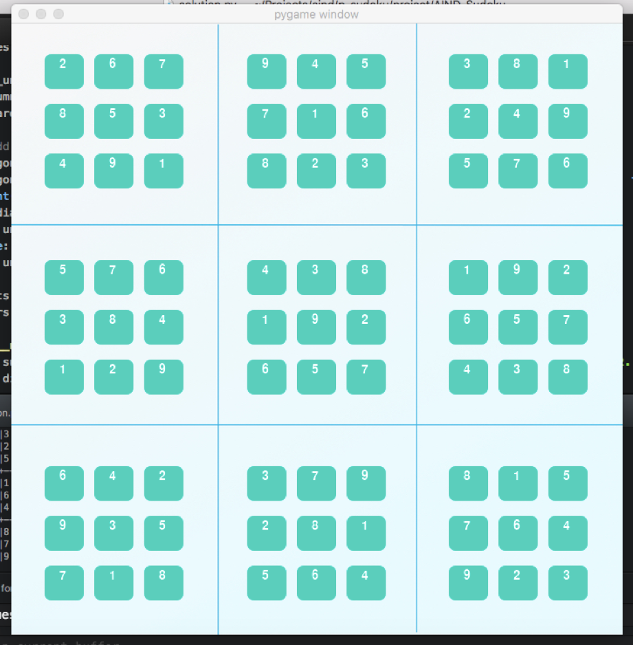

# AI agent that can solve any Sudoku puzzle
## Created as an assignment for the Udacity Artifical Intelligence Nanodegree

## Question 1 (Naked Twins)
Q: How do we use constraint propagation to solve the naked twins problem?  
A: We first find pairs of identical values within each unit. Then, we remove the
digits of the naked-twin pair from the other boxes in the unit repeatedly until
the sudoku board stops changing.

## Question 2 (Diagonal Sudoku)
Q: How do we use constraint propagation to solve the diagonal sudoku problem?  
A: Additional constrains where added to the AI agent in order to solve the
diagonal sudoku problem.

The following constrains (diagonal lines) where added to `unittest`:

[['A1', 'B2', 'C3', 'D4', 'E5', 'F6', 'G7', 'H8', 'I9']
['I1', 'H2', 'G3', 'F4', 'E5', 'D6', 'C7', 'B8', 'A9']]

No need to edit the constrain propagation code since it does not actually care
where each unit is located in the puzzle.

## Author

If you have any questions about this work, please feel free to contact me at Twitter:

[@luiscosio](https://twitter.com/luiscosio)
